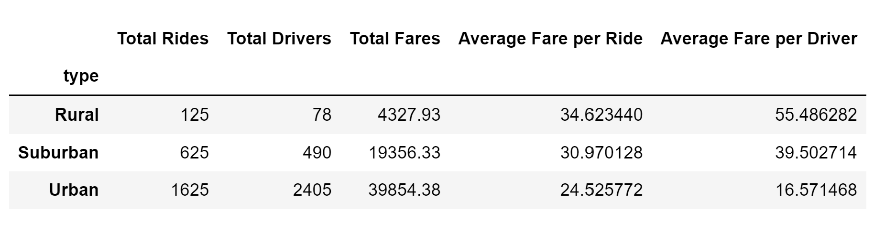
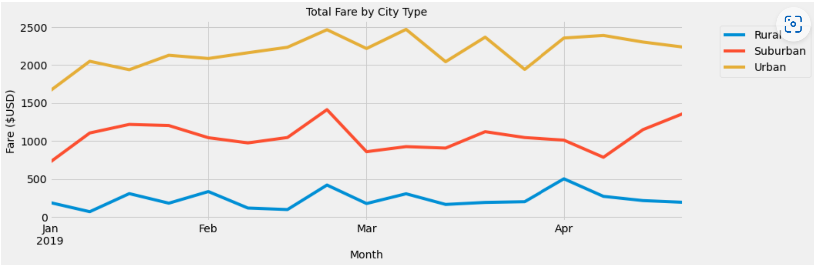

# PyBer_Analysis

## Overview of the Analysis

After completing an analysis for PyBer, a ride-sharing business,a depper dive inte reviewing the data by city type was requested by the CEO. the work includes using Python, Pandas and Matplotlib to create a summary DataFrame and a multi-line graf.
The goal was to compare quantity and fares of rides in every city type: Urban, Suburban and Rural; create clear visualization with matplotlib library and provide recommendation to the CEO for addressing any disparities among the city types.

## Results

In order to perform the analysis, I merged datasets using left join based on the city column and got a one dataset with all available data. First of all, I created summary dataframe by city type. It has revealed first insight - there are few drivers and rides in rural cities with higher average fares compare to urban cities:

* There are way more rides in urban cities compare to rural cities (Urban: 1,625 vs Rural: 125 rides)

* The average fare per ride is less in Urban cities, and average fare per driver is less in urban cities compare to   rural cities (Urban: $24.53 vs Rural: $34.62 and Urban: $16.57 vs Rural: $55.49)

* The total fares in urban cities is higher than in rural cities and higher than suburban cities. (Urban: $39854.38,  Rural: $4327.93, Suburban: $19356.33)

Then I created a multi-line graph that shows the total fares for each type of city. The yellow line for Urban cities is higher than red line (Suburban cities) and blue line (rural cities). That means ride-sharing company has more total fares and revenue in Urban cities rather than in suburban and rural cities.

## Summary

* The results of the summary DataFrame could be due to Urban city types being more compact, which collects a lower average fare per ride, while Rural city types are more spread out, which would collect a higher average fare per ride. To test this theory, PyBer should work to include mileage distance data as part of the data collection process and analysis.

* Because there are more total drivers than total rides in the Urban city types, the Urban drivers may not have enough work to support themselves. PyBer may want to consider investing advertising dollars in the Urban city types to increase the total rides or risk losing Urban drivers.

* If PyBer were to invest into advertising dollars in the Urban city type, the next question is when would ads be the most effective? After reviewing the Total Fare by City Tpye graph, the end of February kicks off the increase in total fares and would be a good time to launch an advertising campaign, which would also strategically help the other two city types.
